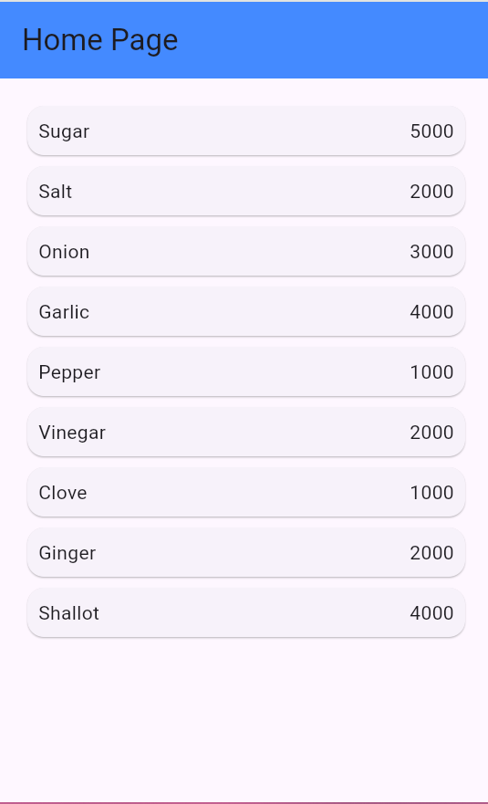
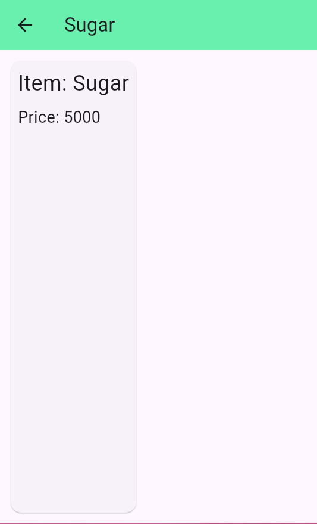

1. Membuat folder 'models' dan 'pages' di folder lib

2. Membuat file dart dengan nama 'item.dart' di folder models

3. isi 'item.dart' di folder models

4. setelah itu isi file pages 

5. membuat file dart dengan nama 'home_pages.dart' setelah itu isi file nya

6. membuat file dart dengan nama 'item_page.dart' setelah itu isi file nya

7. membuat file dart dengan nama 'main.dart' setelah itu isi file nya

8. hasil dari project 

